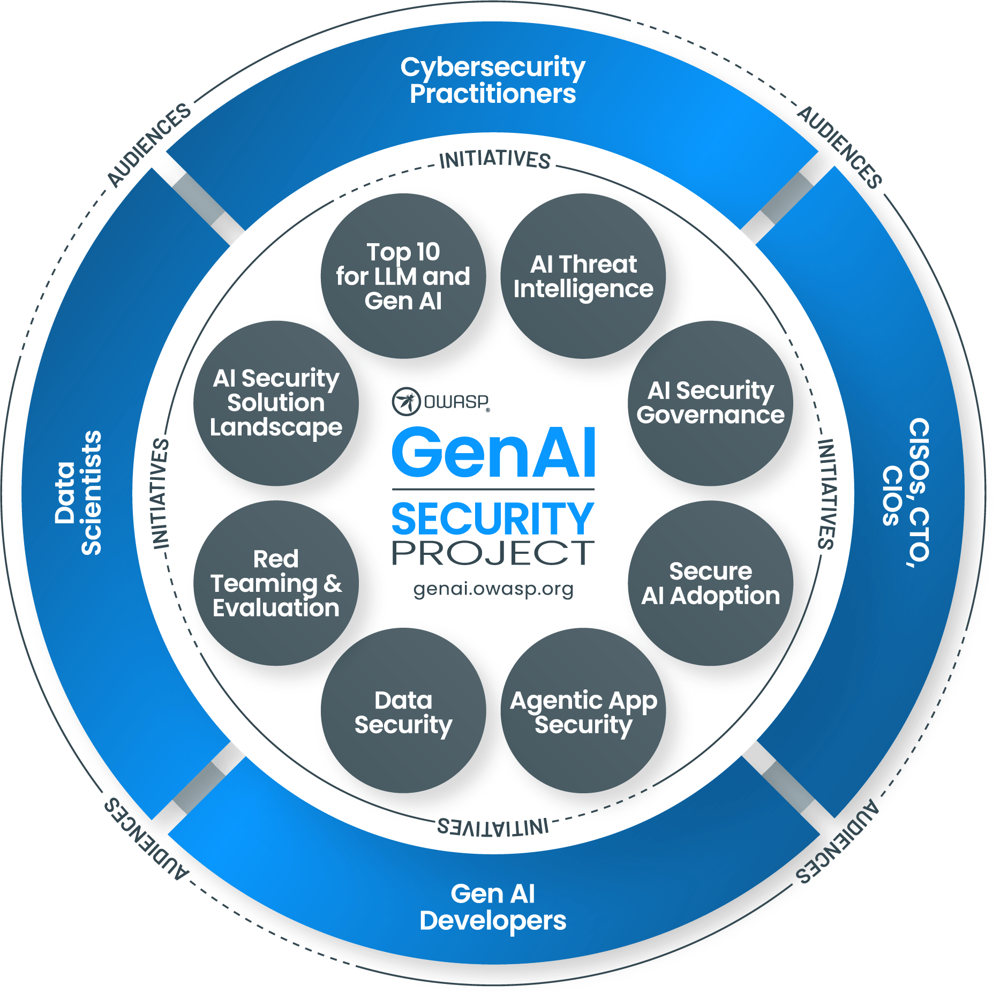

<h1>Welcome to the OWASP Gen AI Secuity Project's Repo</h1>

<h2>About</h2>

The OWASP Gen AI Security Project is a global, open-source initiative dedicated to identifying, mitigating, and documenting security and safety risks associated with generative AI technologies, including large language models (LLMs), agentic AI systems, and AI-driven applications. Our mission is to empower organizations, security professionals, AI practitioners, and policymakers with comprehensive, actionable guidance and tools to ensure the secure development, deployment, and governance of generative AI systems.  
 
The project began as the OWASP Top 10 for LLM Applications, but has rapidly grown beyond that first project to now include over 8 working groups, 14+ projects and growing, all focused at adressing the security lifecycle for LLM, GenAI and Agentic applications. We are consolidating all of the project githubs under one umbrella to help improve collaboration, discoverability and contribution. 
 
For full deatils about our project, joing us at our main website https://genai.owasp.org

<h2>Core Principles</h2>

* <b>Open & Collaborative:</b> The project thrives on global contributions from AI and security experts across industries, academia, and government sectors.
* <b>Transparency & Accessibility:</b> All research outputs are open-source, peer-reviewed, and freely available to ensure widespread adoption and continuous improvement.
* <b> Practical & Actionable Guidance: </b> The project focuses on producing hands-on, implementable security solutions rather than theoretical frameworks.
* <b>Ethical AI Security Advocacy:</b> Promote responsible AI development and deployment by addressing ethical concerns, bias mitigation, and adversarial misuse.

<h2>Project Objectives</h2>

Risk Identification & Documentation
* Maintain and evolve the OWASP Top 10 for LLM Applications, and other reseources, providing a structured framework for understanding generative AI’s most critical security risks.
* Research and document emerging threats, adversarial attack techniques, and potential vulnerabilities specific to AI models and applications.

Security Best Practices & Mitigations
* Develop practical security recommendations and blueprints for securing AI-driven applications.
* Provide governance frameworks, compliance guidelines, safety and risk management strategies tailored for AI security.
* Maintain and expand resources like AI Security Solutions Landscape, a curated repository of security tools, and frameworks, updated quarterly.

Applied Research & Community Collaboration
* Foster research initiatives such as AI Red Teaming & Evaluation, Securing AI-driven Exploit Generation, and Agentic AI Security to explore attack surfaces and mitigation strategies.
* Collaborate with academic institutions, industry leaders, and government agencies to drive AI security research and regulatory alignment.

Education, Training, & Knowledge Sharing
* Provide publicly accessible security resources, training materials, and open-source tools to support AI security education.
* Translate key security documents into multiple languages to ensure accessibility for a global audience.
* Engage security professionals and AI engineers through working groups, webinars, and industry events.

Enterprise Adoption & AI Governance
* Develop and maintain resources to support practitioners and executives alike such as the CISO AI Security Checklist, offering structured guidance for enterprises integrating generative AI into business workflows.
* Support organizations in building AI security governance programs through resources like the OWASP AI Security Center of Excellence (CoE) Guide.
* Provide CISOs and security leaders with governance roadmaps and risk assessment methodologies.
